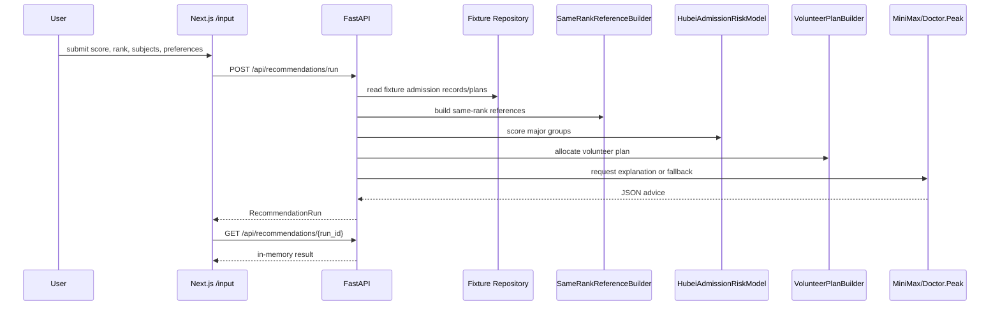
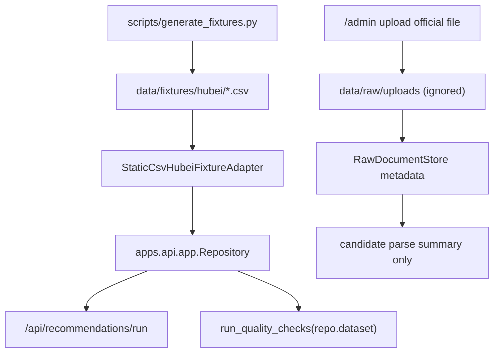
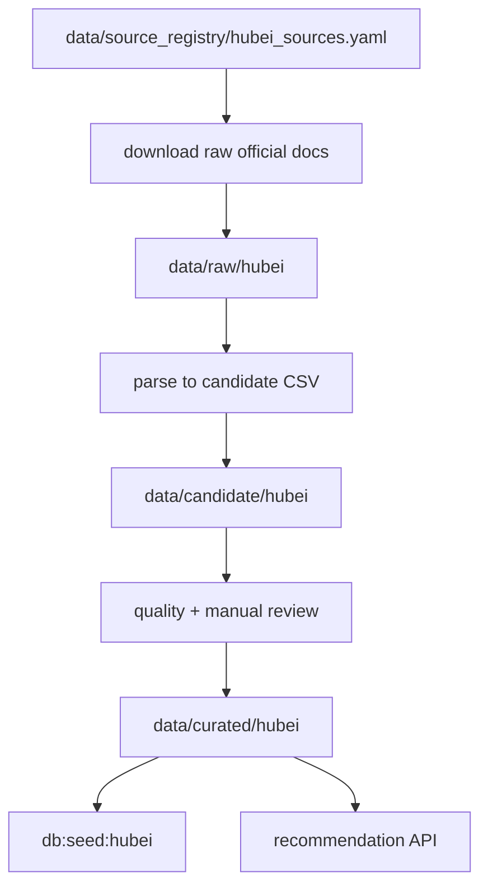

# Current State Audit

Audit date: 2026-06-27  
Branch target: `v0.2-data-productization`

## 1. Repository Tree

```text
hubei-gaokao-advisor/
  apps/
    api/        FastAPI service, local raw upload store, parse job store
    web/        Next.js app and Playwright tests
    worker/     Local parse-job worker
  data/
    fixtures/hubei/  Synthetic demo CSV data
    raw/             Ignored raw upload area
    normalized/      Reserved, currently unused
  db/
    migrations/0001_init.sql
    seeds/001_hubei_seed.sql
  docs/
  packages/shared-types/
  scripts/
  services/
    compliance/
    crawler/
    llm/
    recommender/
  tests/
```

## 2. Entrypoints

- Backend API: `apps/api/app/main.py`, served by `npm run api`.
- Frontend: `apps/web/src/app`, served by `npm run dev:web`.
- Worker: `python -m apps.worker.main`, processes `.tmp/jobs/parse_jobs.json`.
- Data entrypoints:
  - Fixture generation: `scripts/generate_fixtures.py`.
  - Fixture import report: `scripts/import_hubei_fixtures.py`.
  - Admin upload: `POST /api/admin/upload/hubei-plan`.
  - Existing source discovery: `HubeiSourceDiscovery.seed_registry()`.

## 3. Current Database Model

`db/migrations/0001_init.sql` defines tables for provinces, subject types, universities, majors, major groups, data sources, admission records, plans, rank segments, same-rank references, destination aggregates, raw documents, parse jobs, quality reports, user profiles, recommendation runs/items, volunteer plans/items, LLM logs, compliance logs, and skill audit logs.

Current gaps:

- Some default Chinese strings are displayed incorrectly in the terminal due console encoding, but UTF-8 source code constants were verified by code point inspection.
- No `recommendation_traces` table yet.
- No `admin_uploads` table yet.
- API currently keeps recommendation runs in process memory instead of durable storage.
- DB migration exists, but runtime repository reads CSV fixtures directly rather than querying Postgres.

## 4. Recommendation Call Chain

Current backend path:

1. `POST /api/recommendations/run`
2. Build `CandidateProfile`.
3. `SameRankReferenceBuilder.build(...)`
4. `HubeiAdmissionRiskModel.recommend(...)`
5. `VolunteerPlanBuilder.build(...)`
6. `AdviceOrchestrator.explain(...)`
7. Store `RecommendationRun` in in-memory `RUNS`.
8. Return `run.to_dict()`.

Important gaps:

- No fixed trace object per pipeline step.
- No score-rank validation against 2026 rank segments.
- No `plan_status`.
- No CSV export endpoint.
- No missing-current-plan mode.
- Ranking still reads synthetic fixture data.

## 5. Frontend API Usage

`apps/web/src/lib/api.ts` currently calls:

- `POST /api/recommendations/run`
- `GET /api/recommendations/{run_id}`
- `GET /api/admin/raw-documents`
- `POST /api/admin/upload/hubei-plan`
- `GET /api/hubei/parse-jobs`
- `POST /api/hubei/parse-jobs`
- `POST /api/hubei/data-quality/run`

Frontend pages:

- `/`: product landing.
- `/input`: single-form recommendation input.
- `/result/[runId]`: result cards and Doctor.Peak summary.
- `/compare`: five strategy calls using the same recommendation API.
- `/admin`: upload, parse-job queue, and quality-check panel.

## 6. Fixtures vs Real Data

Current runtime repository:

- `apps/api/app/repository.py` loads only `data/fixtures/hubei`.
- Fixture university names use synthetic values such as `湖北样例001大学`.
- Source URLs point to official/quasi-official pages, but admission rows are generated demo data.

Required v0.2 change:

- Introduce raw/candidate/curated layers.
- API default must prefer `data/curated/hubei`.
- Production mode must reject fixture names.
- OCR or low-confidence candidate data must not enter recommendations without `review_status=approved`.

## 7. Doctor.Peak and MiniMax

Current flow:

- `MiniMaxClient.generate_advice(payload)` redacts likely PII fields.
- `/v1/responses` is preferred, `/v1/chat/completions` is supported via `MINIMAX_API_STYLE`.
- Missing key or API failure returns deterministic fallback JSON.
- `AdviceOrchestrator` attaches `doctor_peak_advice` to the run and fills item explanations.

Current gaps:

- Prompt file exists but is not injected into the API request body.
- LLM advice logs are stored in memory only.
- No explicit test yet that full PII fields are excluded from every LLM payload shape.
- Doctor.Peak output schema needs v0.2 fields such as `data_limitations` and `final_checklist`.

## 8. Baseline Command Results

| Command | Result | Notes |
| --- | --- | --- |
| `npm install` | pass | 316 packages audited; npm reports 2 moderate vulnerabilities and pending install-script approvals. |
| `python -m pip install -e .` | fail | PATH has no `python` command in this shell. |
| bundled Python `-m pip install -e .` | fail | Setuptools flat-layout discovery sees multiple top-level packages including `db`, `apps`, `data`, `packages`, `services`, `node_modules`. |
| `pytest` | pass | 28 passed, 1 Starlette deprecation warning. |
| `ruff check .` | pass | All checks passed. |
| `mypy services apps/api tests` | pass | 56 source files checked. |
| `npm --workspace apps/web run lint` | pass | ESLint passed. |
| `npm --workspace apps/web run typecheck` | pass | `tsc --noEmit` passed. |
| `npm --workspace apps/web run build` | pass | Initial parallel run with E2E caused a transient `.next` conflict; sequential rerun passed. |
| `npm --workspace apps/web run test:e2e` | pass | 6 Playwright tests passed. |

## 9. Key Issues

### Blocking

- Editable Python install is broken because `pyproject.toml` does not constrain package discovery.
- Runtime data source is synthetic fixtures, not curated real Hubei data.

### High

- No raw/candidate/curated data productization flow.
- No recommendation trace persistence or trace endpoint.
- No missing-current-plan mode.
- No production guard preventing fixture data from being used.
- No CSV export endpoint.

### Medium

- Admin page does not show source registry, curated status, OCR review queue, or data build report.
- `/input` is a single form rather than the requested three-step flow.
- Score/rank consistency warning is missing.
- MiniMax logs are in memory.

### Low

- Terminal output renders some Chinese text incorrectly under the current PowerShell code page.
- NPM reports moderate vulnerabilities and pending install-script approval notices.

## 10. Current Recommendation Sequence



## 11. Current Data Flow



v0.2 target should replace the recommendation path with:


